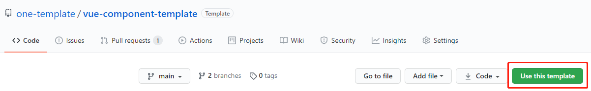

# 🌈 vue-component-template

一个快速开发 vue2 组件的模板，满足组件开发、打包、发布、文档开发、文档打包、文档部署。

[English](./README.md) | 简体中文

## 💖 如何使用？



## 💎 目录介绍

```
├── assets                 存放固定资源
├── docs                   组件文档
│   ├── .vuepress          VuePress
│   │   ├── components     demo 使用
│   │   ├── config.js      VuePress 主配置
│   │   └── enhanceApp.js  VuePress 拓展配置
│   ├── README.md          用于展示组件介绍
│   ├── changelog.md       用于展示组件历史
│   └── demo.md            用于展示组件 Demo
├── examples               组件开发调试
├── public                 组件开发调试展示
├── src                    组件主目录
│   ├── index.js           组件注册
│   └── template.vue       组件实现代码
└── vue.config.js          组件开发打包配置
```

## 🤖 命令介绍

| 名称 | 描述 | 备注 |
| -- | -- | -- |
| `npm run start` | 启动组件开发 | - |
| `npm run build` | 组件打包 | - |
| `npm publish` | 组件发布 | 建议首次移除 prepublishOnly |
| `npm run docs:start` | 文档启动 | - |
| `npm run docs:build` | 文档打包 | - |
| `npm run docs:deploy` | 文档发布 | 这里默认是使用了 GitHub Pages |
| `npm run deploy` | 文档打包发布 | - |

## 🍭 组件

### 开发

```bash
npm i
npm run start
# http://localhost:8080/
```

### 打包

```bash
npm run build
```

- 默认移除了 map
- 默认不拉取独立的 CSS 文件
- 更多查看官网配置
- 打包文件默认生成在 dist 文件中

### 发布

> `package.json` 介绍

1. 如果要进行 npm 发布，`private` 需设置为 `false`。
2. build 命令可根据实际情况修改。
3. main 决定安装组件后 import 指向。
4. files 包含发布时的文件，默认包含 README.md。
5. 其他根据字意即可理解。

## 📚 文档

### 启动

```bash
npm run docs:start
# http://localhost:8888/
```

### 在线预览

https://one-template.github.io/vue-component-template/

### 说明

- 使用 VuePress
- 使用基础布局，更多请自行添加
- 组件的引用，目前需要复制一份到 components 里，若有更好的办法，欢迎 PR
- 因文档部署在 GitHub Pages 上，`config.js` 的 `base` 设置为了项目名
- `highlight.js` 版本谨慎更新
- 一个 🌰 : [Knotes](https://github.com/xrkffgg/Knotes)

## 🎈 辅助

- [Issue 模板](https://github.com/one-template/issue-template)
- [PR 模板](https://github.com/one-template/pr-template)
- [Actions 使用](https://github.com/github-actions-workflows/.github)

## 🎉 谁在使用？

- 

## License

[MIT](https://github.com/one-template/vue-component-template/blob/main/LICENSE)
